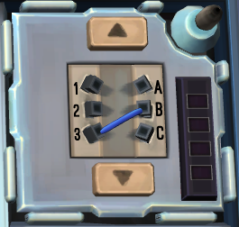

# Keep Talking And No One Explodes Bot: Guide

Built entirely with Java, this program acts as the 
manual of the game Keep Talking And No One
Explodes, providing instruction on how to solve the
modules through use of both console-based programming
and a graphical component.

Below is a guide on how to use the application. To start:

## The Bomb

Upon starting the application, it will ask you 4 questions about 
the exterior of the bomb:

- Whether it has an indicator with label "FRK" and its circular LED lit
- Whether it has an indicator with label "CAR" and its circular LED lit
- Whether the bomb has a parallel port *
- Whether the bomb's serial code contains a vowel

For each of these questions, answer **y** or **n** for yes/no.

Then, it will ask 2 more questions:

- The last character of the serial code (which is always a number)
- The number of batteries on the bomb **

For both, answer with the correct number. 

\ * This is a parallel port:

\ ** Note that two small batteries count as two batteries, while 
1 large battery counts as one.

## The Modules

Once finished with setting the properties of the bomb, it will display a panel 
with all options displayed and their respective keywords. Each keyword 
will solve a specific module.

Note that in order to update the number of strikes on the bomb, enter **us** 
when prompted to select a module. This is important in the case of a mistake,
as the number of strikes affects the solution for the Simon Says module.

With that aside, to the modules:

### Simple Wires

This can be accessed by entering **sw** when prompted to select a module.

Simply enter the colors of the wires from top to bottom, each seperated by a space. 
Once entered, it will tell you which wire should be cut.

Correct spelling is required.

If you need to exit this module before it is solved, input the keyword
**exit**.

For example:

The input is: **yellow white red black**

### Button

This can be accessed by entering **bu** when prompted to select a module.

Simply enter the color of the button, followed by word on it. Once entered, it
will tell you whether to hold or immediately release the button after pressing it.

Correct spelling is required.

If you need to exit this module before it is solved, input the keyword
**exit**.

For example:

The input is: **white hold**

### Keypad

This can be accessed by entering **ke** when prompted to select a module.

If selected, a graphical component will open. On it is a panel with all twenty-seven
possible symbols that could appear.

Select the four that are shown on the keypad module by pressing on each. 
Selected symbols will have a red border to indicate as such; they can be 
deselected by pressing on them again. Once entered, it will tell you in what
order to press the symbols.

To exit the module, simply close the graphical component.

### Simon Says

This can be accessed by entering **ss** when prompted to select a module.

The module repeats all previous color flashes each stage, so simply enter 
the color that *last flashed* in each stage. Once entered, it will 
tell you the sequence of colors you need to press.

Correct spelling is required.

If you need to exit this module before it is solved, input the keyword
**exit**. Note this retains the current state of the module, allowing you to exit
and return to the current module at a later time.

If you make a mistake in the input, you can revert to the previous stage via the
keyword **back**.

As the number of stages for this module is random (between three and five, inclusive), 
once the particular module is solved, the keyword **done** must be entered.
It will reset the solver, allowing you to proceed to solve another 
Simon Says module.

Example input: **blue**

### Who's On First

This can be accessed by entering **wf** when prompted to select a module.

Enter the word on the display first, followed by the six words on the buttons
(left to right, top to bottom), all separated by spaces.

Correct spelling is required.

If a button has two words on it, forgo the space between them. Likewise, 
ignore all apostrophes. If the display is blank (as in does not have a word displayed),
use the keyword **empty** for it instead. 

Once entered, it will tell you the word that you need to press.

To exit the module, enter the keyword **exit**. The solver will not exit on its own, 
unlike the others, thus the keyword will be needed to manually exit.

For example:

The input for the first image is: **youre you u sure next youre uhuh**

The input for the second image is: **empty right press wait middle blank okay**

### Memory

This can be accessed by entering **me** when prompted to select a module.

Enter the number on the display first, followed by the four numbers below
(left to right), all separated by spaces. Once entered, it will tell
you which number to press. This will be repeated for all five stages.

If you need to exit this module before it is solved, input the keyword
**exit**. Note this retains the current state of the module, allowing you to exit
and return to the current module at a later time.

If you make a mistake in the input, you can revert to the previous stage via the
keyword **back**.

Once the module is solved, its memory will be automatically reset, though
if you need to reset it beforehand, use the keyword **done**.

For example:

The input is: **2 1 2 3 4**

### Morse Code

This can be accessed by entering **mc** when prompted to select a module.

Enter the morse code for each letter one by one as prompted, using dots ( *.* ) and 
dashes ( *-* ). The first letter is preceded by a long pause, while sebsequent letters
are indicated by a shorter pause.

If you need to exit this module before it is solved, input the keyword
**exit**. Note this retains the current state of the module, allowing you to exit
and return to the current module at a later time.

If you make a mistake in the input, you can revert to the previous stage via the
keyword **back**.

If a code is found, it will tell you what frequency to respond. If none are found, 
it will inform so, prompting the use of the **back** keyword to check your inputs.
This will occur at latest by the input of the third letter.

Once the module is solved, its memory will be automatically reset, though
if you need to reset it beforehand, use the keyword **done**.

Example input: **..-**

### Complicated Wires

This can be accessed by entering **cw** when prompted to select a module.

Enter the properties of each of the wires, with each wire separated by a space.
For each individual wire:

- If the wire has any red color on it, enter the keyword **r**
- If the wire has any blue color on it, enter the keyword **b**
- If the wire has a lit LED above, enter the keyword **l**
- If the wire has a star marking below, enter the keyword **s**
- If the wire has none of the above, enter the keyword **n**

Should the wire have multiple of the above properties, type all their respective
keywords together, without spaces (the order of the keywords does not matter).

Once inputted, it will tell you "yes" or "no" regarding whether each wire should be cut, 
in the order of which you inputted the wires. This allows you to input all the wires from
multiple Complicated Wires modules and solve them all in one go.

If you need to exit this module before it is solved, input the keyword
**exit**.

For example:

The input for the first image is: **b bl rs rs l rs**

The input for the second image is: **rbl bsl rsl n**

### Wire Sequences

This can be accessed by entering **ws** when prompted to select a module.

Enter each wire with its color, followed by the letter to which it is attached
to on the right, separated by a space. With multiple wires, you must also add the 
keyword **next** between each wire input, and crucially in the correct order
(Your input should follow ascending order based on what number the wires are
attached to on the left). 

Once inputted, it will tell you "yes" or "no" regarding whether each wire should be cut,
in the order of which you inputted the wires. This will be repeated for all four
stages.

If you need to exit this module before it is solved, input the keyword
**exit**. Note this retains the current state of the module, allowing you to exit
and return to the current module at a later time.

If you make a mistake in the input, you can revert to the previous stage via the
keyword **back**.

Once the module is solved, its memory will be automatically reset, though
if you need to reset it beforehand, use the keyword **done**.

For example:

The input for the first image is: **blue b**

The input for the second image is: **black b next black c next red b**

### Maze

This can be accessed by entering **mz** when prompted to select a module.

Enter four two-digit numbers, all separated by spaces. The first two are the
locations of the green circles (the order does not matter). The third is the
location of the target (the red triangle), and the last is your location (the
white square).

For each location, the first digit is the column number (1 = leftmost column, 
6 = rightmost column), and the second digit is the row number (1 = uppermost row,
6 = lowest row).

Once inputted, it will tell you the list of moves to be pressed to reach the target.

If you need to exit this module before it is solved, input the keyword
**exit**.

For example:

The input is: **15 32 43 11**

### Password

This can be accessed by entering **pa** when prompted to select a module.

Enter the six available letters for each column one by one as prompted, 
separated by spaces. (the order does not matter).

If you need to exit this module before it is solved, input the keyword
**exit**. Note this retains the current state of the module, allowing you to exit
and return to the current module at a later time.

If you make a mistake in the input, you can revert to the previous stage via the
keyword **back**.

If a password is found, it will tell you what it is. If none are found,
it will inform so, prompting the use of the **back** keyword to check your inputs.

Once the module is solved, its memory will be automatically reset, though
if you need to reset it beforehand, use the keyword **done**.

Example input: **a c y m j q**

### Venting Gas (Needy)

This can be accessed by entering **ve** when prompted to select a module.

No input is needed, simply follow the directions given.

### Capacitor Discharge (Needy)

This can be accessed by entering **cd** when prompted to select a module.

No input is needed, simply follow the directions given.

### Knobs (Needy)

This can be accessed by entering **kn** when prompted to select a module.

Your input should be in the form of a series of 0's (representing an LED not lit)
and 1's (representing a lit LED), without spaces, from left to right, top to bottom,
followed by a space, then the direction in which the word "UP" is on the module
(up, right, down, left).

Once inputted, it will tell you the *absolute* position that you should put the
pointer in, not the position relative to the "UP" label on the module.

If you need to exit this module before it is solved, input the keyword
**exit**.

For example:

The input is: **101010010001 left**
